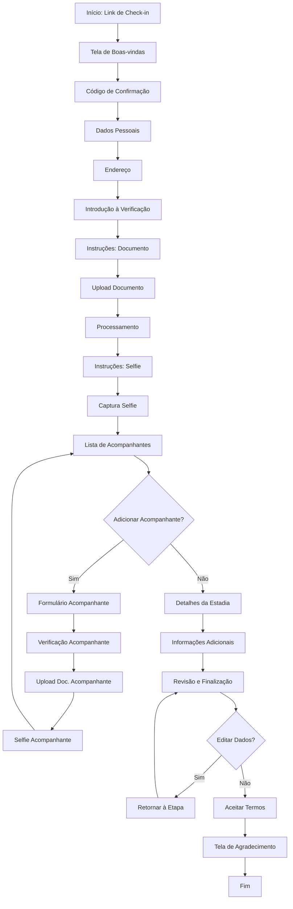

# PRD - Sistema de Check-in Online Gonzaga Stays

## 1. Visão Geral do Produto

### 1.1 Descrição
Sistema web de check-in online para hóspedes da Gonzaga Stays, permitindo o cadastro antecipado de dados pessoais, verificação de identidade e documentos antes da chegada, proporcionando uma experiência fluida e sem atritos no processo de hospedagem.

### 1.2 Objetivos do Produto
- Coletar dados completos do hóspede principal e acompanhantes antes da chegada
- Realizar verificação de identidade através de documentos e reconhecimento facial
- Reduzir o tempo de check-in presencial
- Garantir conformidade com requisitos de segurança e legislação hoteleira
- Proporcionar uma experiência moderna, intuitiva e amigável ao usuário

### 1.3 Público-Alvo
- Hóspedes com reservas confirmadas na Gonzaga Stays
- Faixa etária: Maiores de 18 anos (hóspede principal)
- Perfil: Usuários com conhecimento básico de tecnologia, acesso a smartphones ou computadores

---

## 2. Identidade Visual e Brand Guidelines

### 2.1 Personalidade da Marca
- **Tom**: Moderno, inteligente, rápido e confiável
- **Estilo**: Sofisticação acessível
- **Foco**: Segurança e excelente experiência ao cliente
- **Representação**: Estilo de vida dinâmico e conectado

### 2.2 Paleta de Cores

| Cor | Código Hex | Uso |
|-----|------------|-----|
| Gonzaga Orange (Principal) | `#FF5518` | Botões de ação, destaques, elementos principais |
| Gonzaga Dark Blue | `#080732` | Fundos, títulos principais, textos de alto contraste |
| Gonzaga Off-White | `#EFEFE4` | Fundo principal, aparência limpa e sofisticada |

### 2.3 Assets Visuais

| Asset | URL | Uso |
|-------|-----|-----|
| Logo Principal (Laranja) | https://i.imgur.com/9GO4TXl.png | Contextos com fundo claro |
| Logo Principal (Branco) | https://i.imgur.com/NwhEuLt.png | Contextos com fundo escuro |
| Símbolo "Bobi" (Laranja) | https://i.imgur.com/zSN2Hlg.png | Elementos decorativos |
| Símbolo "Bobi" (Branco) | https://i.imgur.com/PMG3QQw.png | Elementos decorativos em fundo escuro |
| Símbolo "G" (Laranja) | https://i.imgur.com/tBAHzHw.png | Favicon, ícones |
| Textura Coelhos | https://i.imgur.com/mBoekb0.png | Backgrounds decorativos |
| Textura Linhas | https://i.imgur.com/p38pk3Y.png | Backgrounds decorativos |

---

## 3. Arquitetura do Sistema

### 3.1 Stack Tecnológico
- **Frontend**: React 18.3.1 com TypeScript
- **Build Tool**: Vite
- **Styling**: Tailwind CSS com shadcn/ui components
- **Gerenciamento de Estado**: React Hooks (useState)
- **Validações**: Zod + React Hook Form
- **Roteamento**: React Router DOM
- **Notificações**: Sonner (Toast)

### 3.2 Estrutura de Componentes

```
src/
├── components/
│   ├── CheckInFlow.tsx              # Componente principal do fluxo
│   └── checkin/
│       ├── CheckInProgress.tsx      # Barra de progresso
│       ├── WelcomeScreen.tsx        # Tela inicial
│       ├── PersonalInfoScreen.tsx   # Dados pessoais
│       ├── AddressScreen.tsx        # Endereço residencial
│       ├── VerificationIntroScreen.tsx
│       ├── DocumentUploadScreen.tsx # Upload de documentos
│       ├── ProcessingScreen.tsx     # Processamento
│       ├── SelfieInstructionsScreen.tsx
│       ├── SelfieCaptureScreen.tsx  # Captura de selfie
│       ├── CompanionsScreen.tsx     # Listagem de acompanhantes
│       ├── CompanionForm.tsx        # Cadastro de acompanhante
│       ├── StayDetailsScreen.tsx    # Detalhes da estadia
│       ├── AdditionalInfoScreen.tsx # Informações adicionais
│       ├── FinalizationScreen.tsx   # Revisão final
│       └── ThankYouScreen.tsx       # Agradecimento
├── lib/
│   ├── cpf-validator.ts            # Validação e formatação de CPF
│   ├── cep-service.ts              # Consulta de CEP (ViaCEP API)
│   ├── countries.ts                # Lista de países com bandeiras
│   └── utils.ts                    # Utilidades gerais
└── pages/
    └── Index.tsx                   # Página principal
```

---

## 4. Fluxo do Usuário (User Journey)

### 4.1 Diagrama de Fluxo



### 4.2 Etapas Detalhadas

#### **Etapa 1: Boas-vindas**
- **Objetivo**: Identificar a reserva
- **Campos**: Código de confirmação
- **Validação**: Campo obrigatório
- **Navegação**: Avançar

#### **Etapa 2: Dados Pessoais (Hóspede Principal)**
- **Objetivo**: Coletar informações básicas do hóspede
- **Campos**:
  - Tipo de documento (CPF ou Passaporte)
  - Número do documento (com máscara e validação para CPF)
  - Nome completo
  - Sobrenome
  - Data de nascimento
  - País (seletor com bandeiras)
  - Código do país (seletor com bandeiras - Brasil, EUA, depois alfabético)
  - Telefone
  - E-mail
- **Validações**:
  - CPF válido (algoritmo de verificação de dígitos)
  - Idade mínima: 18 anos
  - E-mail válido
  - Telefone com formato correto
  - Todos os campos obrigatórios
- **Navegação**: Voltar, Avançar

#### **Etapa 3: Endereço Residencial**
- **Objetivo**: Coletar endereço completo
- **Campos**:
  - CEP (com máscara: 00000-000)
  - Endereço (auto-preenchimento via ViaCEP)
  - Número
  - Complemento (opcional)
  - Bairro (auto-preenchimento)
  - Cidade (auto-preenchimento)
  - Estado/UF (auto-preenchimento)
- **Funcionalidades**:
  - Integração com API ViaCEP
  - Auto-completar ao digitar CEP válido
  - Loading indicator durante busca
  - Permite edição manual dos campos
- **Validações**:
  - CEP válido (8 dígitos)
  - Campos obrigatórios preenchidos
- **Navegação**: Voltar, Avançar

#### **Etapa 4: Introdução à Verificação**
- **Objetivo**: Preparar o usuário para a verificação de identidade
- **Conteúdo**: Explicação das próximas etapas (documento + selfie)
- **Navegação**: Voltar, Continuar

#### **Etapa 5: Instruções para Documento**
- **Objetivo**: Orientar sobre como fotografar o documento
- **Orientações**:
  - Documento original (não fotocópia)
  - Remover capa plástica
  - Boa iluminação
  - Fundo sólido e contrastante
  - Sem reflexos ou sombras
  - Documento inteiro visível
- **Navegação**: Voltar, Continuar

#### **Etapa 6: Upload de Documento**
- **Objetivo**: Capturar fotos do documento
- **Campos**:
  - Upload da frente do documento
  - Upload do verso do documento
- **Formatos aceitos**: JPEG, PNG, PDF
- **Tamanho máximo**: A definir (recomendado: 5MB por arquivo)
- **Validações**:
  - Ambos os lados obrigatórios
  - Formato de arquivo válido
- **Navegação**: Voltar, Avançar

#### **Etapa 7: Processamento**
- **Objetivo**: Feedback visual durante upload
- **Conteúdo**: Loading indicator com mensagem "Processando seus documentos..."
- **Navegação**: Automática após processamento

#### **Etapa 8: Instruções para Selfie**
- **Objetivo**: Orientar sobre como tirar a selfie
- **O que fazer**:
  - Expressão natural
  - Rosto completamente visível
  - Boa iluminação
  - Centralizar o rosto
- **O que evitar**:
  - Bonés ou chapéus
  - Óculos escuros
  - Mãos no rosto
  - Pouca luz
- **Observação**: Solicitará permissão de câmera
- **Navegação**: Voltar, Estou Pronto

#### **Etapa 9: Captura de Selfie**
- **Objetivo**: Realizar reconhecimento facial
- **Funcionalidades**:
  - Solicitar permissão de câmera
  - Ativar câmera frontal
  - Exibir guia oval para centralização do rosto
  - Capturar foto
  - Pré-visualização da foto capturada
  - Opção de recapturar
- **Validações**:
  - Permissão de câmera concedida
  - Foto capturada com sucesso
- **Navegação**: Voltar, Capturar, Continuar

#### **Etapa 10: Cadastro de Acompanhantes**
- **Objetivo**: Registrar todos os acompanhantes da reserva
- **Funcionalidades**:
  - Listar acompanhantes cadastrados
  - Adicionar novo acompanhante
  - Remover acompanhante
- **Regras**:
  - Acompanhantes podem ser menores de 18 anos
  - Cada acompanhante passa pelo mesmo processo de verificação
- **Navegação**: Voltar, Continuar

#### **Etapa 10.1: Formulário do Acompanhante**
- **Objetivo**: Coletar dados do acompanhante
- **Campos**:
  - Tipo de documento (CPF ou Passaporte)
  - Número do documento (com máscara e validação)
  - Nome completo
  - Sobrenome
  - Data de nascimento
  - País (seletor com bandeiras)
  - Código do país (seletor com bandeiras)
  - Telefone
  - E-mail
- **Validações**:
  - CPF válido (se aplicável)
  - Sem idade mínima (aceita menores)
  - E-mail não pode ser igual ao do hóspede principal
  - Telefone válido
- **Navegação**: Cancelar, Salvar e Verificar

#### **Etapa 10.2: Verificação do Acompanhante**
- **Objetivo**: Verificar identidade do acompanhante
- **Processo**: Mesmo fluxo do hóspede principal
  1. Upload de documento (frente e verso)
  2. Captura de selfie com guia oval
- **Padrões**: Mesmos da verificação principal
- **Navegação**: Voltar, Continuar

#### **Etapa 11: Detalhes da Estadia**
- **Objetivo**: Coletar informações sobre chegada e saída
- **Campos**:
  - Horário previsto de chegada
  - Horário previsto de saída
- **Informações exibidas**:
  - Check-in padrão: 15:00h
  - Check-out padrão: 11:00h
- **Validação**:
  - Checkbox obrigatória: "Declaro estar ciente dos horários padrão"
- **Navegação**: Voltar, Continuar

#### **Etapa 12: Informações Adicionais**
- **Objetivo**: Coletar dados para pesquisa e melhoria do serviço
- **Campos**:
  - Motivo da viagem (dropdown):
    - Trabalho
    - Lazer
    - Evento
    - Outro
  - Cidade de origem
  - Como conheceu Gonzaga Stays (dropdown):
    - Google
    - Redes Sociais
    - Indicação
    - Booking/Airbnb
    - Outro
  - Já conhece a cidade? (Radio):
    - Sim
    - Não
- **Validações**: Campos obrigatórios
- **Navegação**: Voltar, Continuar

#### **Etapa 13: Revisão e Finalização**
- **Objetivo**: Permitir revisão final antes de enviar
- **Conteúdo exibido**:
  - Resumo dos dados pessoais (com botão Editar)
  - Lista de acompanhantes (com botão Editar)
  - Detalhes da estadia (com botão Editar)
  - Informações adicionais
- **Funcionalidades**:
  - Botões "Editar" para retornar a etapas específicas
  - Checkbox: "Aceito os Termos de Uso e Política de Privacidade"
- **Validações**:
  - Aceite dos termos obrigatório
- **Navegação**: Voltar, Finalizar Check-in

#### **Etapa 14: Agradecimento**
- **Objetivo**: Confirmar conclusão do check-in
- **Conteúdo**:
  - Logo da Gonzaga Stays
  - Mensagem de sucesso
  - Informações sobre próximos passos
  - Texto: "Você receberá as demais informações via WhatsApp ou pela plataforma onde fez a reserva"
- **Navegação**: Nenhuma (fim do fluxo)

---

## 5. Requisitos Funcionais

### 5.1 Autenticação e Identificação
- **RF001**: Sistema deve aceitar código de confirmação da reserva
- **RF002**: Código deve ser validado antes de prosseguir

### 5.2 Coleta de Dados
- **RF003**: Coletar dados pessoais completos do hóspede principal
- **RF004**: Coletar endereço residencial completo
- **RF005**: Permitir cadastro de múltiplos acompanhantes
- **RF006**: Coletar dados de cada acompanhante individualmente
- **RF007**: Coletar horários de chegada e saída
- **RF008**: Coletar informações adicionais para pesquisa

### 5.3 Validações de Dados
- **RF009**: Validar CPF usando algoritmo de dígito verificador
- **RF010**: Aplicar máscara de CPF: 000.000.000-00
- **RF011**: Validar idade mínima de 18 anos para hóspede principal
- **RF012**: Permitir acompanhantes menores de 18 anos
- **RF013**: Validar formato de e-mail
- **RF014**: Validar CEP e aplicar máscara: 00000-000
- **RF015**: Validar que e-mail do acompanhante seja diferente do titular

### 5.4 Integração com APIs Externas
- **RF016**: Integrar com ViaCEP para busca de endereço
- **RF017**: Auto-preencher campos de endereço ao informar CEP
- **RF018**: Exibir loading durante busca de CEP
- **RF019**: Permitir edição manual mesmo com auto-preenchimento

### 5.5 Verificação de Identidade
- **RF020**: Permitir upload de documento (frente e verso)
- **RF021**: Aceitar formatos: JPEG, PNG, PDF
- **RF022**: Validar que ambos os lados do documento foram enviados
- **RF023**: Solicitar permissão de câmera para selfie
- **RF024**: Capturar selfie com guia visual (oval)
- **RF025**: Permitir pré-visualização da selfie
- **RF026**: Permitir recaptura de selfie
- **RF027**: Aplicar mesmo processo de verificação para cada acompanhante

### 5.6 Navegação e Fluxo
- **RF028**: Exibir barra de progresso visual em todas as etapas
- **RF029**: Permitir navegação "Voltar" em todas as etapas (exceto final)
- **RF030**: Permitir edição de dados na tela de finalização
- **RF031**: Navegar diretamente para etapa específica ao clicar em "Editar"
- **RF032**: Manter dados preenchidos ao navegar entre etapas

### 5.7 Seleção de País
- **RF033**: Exibir seletor de países com bandeiras
- **RF034**: Ordenar países: Brasil, Estados Unidos, depois alfabético
- **RF035**: Exibir código de discagem (DDI) junto com bandeira
- **RF036**: Aplicar mesmo seletor para país de residência

### 5.8 Finalização
- **RF037**: Exibir resumo completo antes de finalizar
- **RF038**: Exigir aceite dos Termos de Uso e Política de Privacidade
- **RF039**: Enviar todos os dados ao finalizar
- **RF040**: Exibir tela de agradecimento após conclusão
- **RF041**: Informar sobre recebimento de informações via WhatsApp/Plataforma

---

## 6. Requisitos Não-Funcionais

### 6.1 Performance
- **RNF001**: Carregar página inicial em menos de 3 segundos
- **RNF002**: Resposta de validações em tempo real (< 500ms)
- **RNF003**: Busca de CEP em menos de 2 segundos
- **RNF004**: Upload de imagens com feedback de progresso

### 6.2 Usabilidade
- **RNF005**: Interface responsiva para mobile, tablet e desktop
- **RNF006**: Suporte a navegadores modernos (Chrome, Firefox, Safari, Edge)
- **RNF007**: Feedback visual para todas as ações do usuário
- **RNF008**: Mensagens de erro claras e acionáveis
- **RNF009**: Acessibilidade WCAG 2.1 nível AA

### 6.3 Segurança
- **RNF010**: Transmissão de dados via HTTPS
- **RNF011**: Validação de dados no frontend e backend
- **RNF012**: Armazenamento seguro de documentos e fotos
- **RNF013**: Conformidade com LGPD (Lei Geral de Proteção de Dados)

### 6.4 Compatibilidade
- **RNF014**: Suporte a câmeras frontais em dispositivos móveis
- **RNF015**: Suporte a upload de arquivos em todos os navegadores
- **RNF016**: Suporte a dark mode

### 6.5 Manutenibilidade
- **RNF017**: Código componentizado e reutilizável
- **RNF018**: TypeScript para type safety
- **RNF019**: Documentação de componentes e funções
- **RNF020**: Testes automatizados (a implementar)

---

## 7. Validações e Regras de Negócio

### 7.1 Validação de CPF
```typescript
// Algoritmo de validação de CPF
- Remover caracteres não numéricos
- Verificar se tem 11 dígitos
- Verificar se não são todos dígitos iguais
- Calcular primeiro dígito verificador
- Calcular segundo dígito verificador
- Comparar com os dígitos informados
```

### 7.2 Validação de Idade
```typescript
// Hóspede Principal
- Calcular idade a partir da data de nascimento
- Idade >= 18 anos

// Acompanhante
- Sem restrição de idade mínima
```

### 7.3 Validação de E-mail
```typescript
// Validação de unicidade
- E-mail do acompanhante != E-mail do hóspede principal
- Formato de e-mail válido (regex)
```

### 7.4 Validação de CEP
```typescript
// Formato e Consulta
- Aplicar máscara: 00000-000
- Consultar API ViaCEP
- Tratar erro de CEP não encontrado
- Permitir edição manual após consulta
```

### 7.5 Validação de Documentos
```typescript
// Upload de Arquivos
- Formatos aceitos: .jpg, .jpeg, .png, .pdf
- Tamanho máximo: 5MB por arquivo
- Obrigatório: frente E verso
```

### 7.6 Validação de Câmera
```typescript
// Permissões e Captura
- Verificar permissão de câmera
- Exibir mensagem se permissão negada
- Validar que foto foi capturada
- Permitir múltiplas tentativas
```

---

## 8. Design System e UI/UX

### 8.1 Princípios de Design
- **Clareza**: Informações organizadas e fáceis de entender
- **Consistência**: Padrões visuais mantidos em todo o fluxo
- **Feedback**: Resposta visual para todas as ações
- **Acessibilidade**: Contraste adequado, textos legíveis
- **Responsividade**: Adaptação a diferentes tamanhos de tela

### 8.2 Componentes Principais

#### Cards
- Fundo: `background`
- Borda: `border`
- Sombra: Suave
- Border radius: `rounded-lg`
- Padding: `p-6`

#### Botões
- **Primário**: Gonzaga Orange (#FF5518), texto branco
- **Secundário**: Borda laranja, texto laranja
- **Ghost**: Transparente, texto padrão
- Estados: hover, active, disabled
- Ícones: Lucide React

#### Inputs
- Borda: `border`
- Foco: Ring laranja
- Label: Acima do campo
- Erro: Texto vermelho abaixo
- Placeholder: Texto `muted-foreground`

#### Progress Bar
- Fundo: `secondary`
- Preenchimento: Gradiente laranja
- Altura: 2px
- Transição suave

#### Seletores de País
- Bandeira (emoji) + Nome do país
- Dropdown com scroll
- Busca integrada (futuro)

### 8.3 Tipografia
- Heading 1: `text-3xl font-bold`
- Heading 2: `text-2xl font-semibold`
- Body: `text-base`
- Label: `text-sm font-medium`
- Helper text: `text-sm text-muted-foreground`

### 8.4 Espaçamento
- Entre seções: `space-y-6`
- Entre campos: `space-y-4`
- Margens externas: `p-4` a `p-8`
- Grid: `gap-4`

### 8.5 Ícones
- Biblioteca: Lucide React
- Tamanho padrão: `h-6 w-6`
- Cor: Herda do texto ou `text-primary`

### 8.6 Animações
```css
@keyframes fade-in
@keyframes slide-in
@keyframes pulse-glow
```
- Duração: 300ms - 600ms
- Easing: `cubic-bezier(0.4, 0, 0.2, 1)`

---

## 9. Mensagens e Textos

### 9.1 Mensagens de Sucesso
- "Dados salvos com sucesso!"
- "Check-in realizado com sucesso!"
- "Acompanhante adicionado!"

### 9.2 Mensagens de Erro
- "CPF inválido. Verifique os números digitados."
- "Você deve ter pelo menos 18 anos para fazer o check-in."
- "O e-mail do acompanhante não pode ser igual ao do hóspede principal."
- "CEP não encontrado. Verifique o número digitado."
- "Permissão de câmera negada. Por favor, habilite nas configurações."
- "Todos os campos obrigatórios devem ser preenchidos."

### 9.3 Textos Informativos
- "Liberação do apto. ocorre às 15:00h e a saída deve ser até as 11:00h"
- "Para sua segurança, precisaremos verificar sua identidade"
- "Você receberá as demais informações via WhatsApp ou pela plataforma onde fez a reserva"

---

## 10. Integrações

### 10.1 ViaCEP API
- **Endpoint**: `https://viacep.com.br/ws/{cep}/json/`
- **Método**: GET
- **Response**:
```json
{
  "cep": "01001-000",
  "logradouro": "Praça da Sé",
  "complemento": "lado ímpar",
  "bairro": "Sé",
  "localidade": "São Paulo",
  "uf": "SP"
}
```
- **Erro**: `{ "erro": true }`
- **Timeout**: 5 segundos

### 10.2 Backend (A Implementar)
- Endpoint de autenticação por código de reserva
- Endpoint de upload de documentos
- Endpoint de upload de selfie
- Endpoint de salvamento de dados do check-in
- Endpoint de envio de confirmação (WhatsApp/E-mail)

---

## 11. Testes e Qualidade

### 11.1 Testes Manuais (Checklist)
- [ ] Validação de CPF com diferentes entradas
- [ ] Validação de idade (maior/menor de 18)
- [ ] Auto-preenchimento de CEP
- [ ] Seleção de países com bandeiras
- [ ] Upload de documentos (formatos válidos/inválidos)
- [ ] Captura de selfie em diferentes dispositivos
- [ ] Navegação entre etapas (voltar/avançar)
- [ ] Edição de dados na tela de finalização
- [ ] Fluxo completo em mobile
- [ ] Fluxo completo em desktop
- [ ] Dark mode

### 11.2 Testes Automatizados (Futuro)
- Unit tests: Funções de validação
- Integration tests: Fluxo completo
- E2E tests: Cypress ou Playwright
- Visual regression tests

### 11.3 Critérios de Aceitação
- 100% das validações funcionando
- 0 erros de console
- Performance: < 3s load time
- Responsivo em todos os breakpoints
- Acessibilidade: score > 90 (Lighthouse)

---

## 12. Roadmap e Melhorias Futuras

### 12.1 Fase 2 (Curto Prazo)
- [ ] Implementar backend completo
- [ ] Integração com sistema de reservas
- [ ] OCR para leitura automática de documentos
- [ ] Reconhecimento facial real (liveness detection)
- [ ] Salvar progresso e permitir continuar depois
- [ ] E-mail de confirmação automático
- [ ] Integração com WhatsApp Business API

### 12.2 Fase 3 (Médio Prazo)
- [ ] Suporte a outros idiomas (i18n)
- [ ] Dashboard administrativo para hotelaria
- [ ] Estatísticas e analytics
- [ ] Assinatura digital de contratos
- [ ] Upload de comprovante de pagamento
- [ ] Check-out online
- [ ] Sistema de avaliações

### 12.3 Fase 4 (Longo Prazo)
- [ ] App mobile nativo (iOS/Android)
- [ ] Integração com fechaduras eletrônicas
- [ ] Chatbot para suporte
- [ ] Programa de fidelidade
- [ ] Upsell de serviços durante check-in

---

## 13. Riscos e Mitigações

| Risco | Impacto | Probabilidade | Mitigação |
|-------|---------|---------------|-----------|
| Usuário sem câmera no dispositivo | Alto | Baixo | Permitir upload de selfie como alternativa |
| API ViaCEP indisponível | Médio | Baixo | Implementar fallback para preenchimento manual |
| Permissão de câmera negada | Médio | Médio | Instruções claras + opção de upload |
| Documentos ilegíveis | Alto | Médio | Validação de qualidade + permitir novo upload |
| Dados incorretos preenchidos | Médio | Alto | Validações robustas + tela de revisão |
| Abandono do fluxo no meio | Médio | Médio | Salvar progresso + lembrete por e-mail |

---

## 14. KPIs e Métricas de Sucesso

### 14.1 Métricas de Produto
- Taxa de conclusão do check-in online: > 85%
- Tempo médio de conclusão: < 10 minutos
- Taxa de abandono por etapa: < 5%
- Taxa de erro em validações: < 3%

### 14.2 Métricas de Negócio
- Redução do tempo de check-in presencial: > 70%
- Satisfação do usuário (NPS): > 8.0
- Redução de erros em cadastros: > 50%
- Taxa de adoção: > 90% dos hóspedes

### 14.3 Métricas Técnicas
- Performance (Lighthouse): > 90
- Acessibilidade (Lighthouse): > 90
- Uptime: > 99.5%
- Tempo de resposta: < 2s (p95)

---

## 15. Dependências e Pré-requisitos

### 15.1 Dependências Externas
- API ViaCEP funcionando
- Navegador com suporte a getUserMedia (câmera)
- Conectividade de internet
- Dispositivo com câmera (para selfie)

### 15.2 Dependências Internas
- Sistema de reservas (fornecimento de códigos)
- Servidor de backend (a implementar)
- Armazenamento de arquivos (AWS S3, Cloudinary, etc.)
- Serviço de e-mail/WhatsApp

### 15.3 Pré-requisitos do Usuário
- Reserva confirmada
- Código de confirmação válido
- Documentos originais em mãos
- Acesso a dispositivo com câmera

---

## 16. Documentação Técnica

### 16.1 Estrutura de Dados

#### GuestData
```typescript
interface GuestData {
  bookingCode?: string;
  documentType?: 'cpf' | 'passport';
  documentNumber?: string;
  firstName?: string;
  lastName?: string;
  birthDate?: string;
  countryCode?: string;
  phone?: string;
  email?: string;
  country?: string;
  
  // Address
  cep?: string;
  address?: string;
  number?: string;
  complement?: string;
  neighborhood?: string;
  city?: string;
  state?: string;
  
  // Documents
  documentFront?: File;
  documentBack?: File;
  selfie?: string;
  
  // Companions
  companions?: CompanionData[];
  
  // Stay details
  arrivalTime?: string;
  departureTime?: string;
  acknowledgedTimes?: boolean;
  
  // Additional info
  tripReason?: string;
  originCity?: string;
  howKnew?: string;
  knowsCity?: string;
  
  // Terms
  acceptedTerms?: boolean;
}
```

#### CompanionData
```typescript
interface CompanionData {
  id: string;
  documentType: 'cpf' | 'passport';
  documentNumber: string;
  firstName: string;
  lastName: string;
  birthDate: string;
  countryCode: string;
  phone: string;
  email: string;
  documentFront?: File;
  documentBack?: File;
  selfie?: string;
}
```

#### Country
```typescript
interface Country {
  code: string;
  name: string;
  flag: string;
  dialCode: string;
}
```

### 16.2 Funções Principais

#### CPF Validation
```typescript
export function validateCPF(cpf: string): boolean
export function formatCPF(value: string): string
export function calculateAge(birthDate: string): number
```

#### CEP Service
```typescript
export async function fetchCEP(cep: string): Promise<CEPData>

interface CEPData {
  cep: string;
  logradouro: string;
  complemento: string;
  bairro: string;
  localidade: string;
  uf: string;
  erro?: boolean;
}
```

#### Countries
```typescript
export const countries: Country[]
export const getCountryByCode(code: string): Country | undefined
```

---

## 17. Suporte e Manutenção

### 17.1 Canais de Suporte
- E-mail: suporte@gonzagastays.com.br
- WhatsApp: +55 (XX) XXXXX-XXXX
- FAQ na plataforma
- Chat online (horário comercial)

### 17.2 SLA
- Tempo de resposta: < 2 horas (horário comercial)
- Tempo de resolução: < 24 horas (bugs críticos)
- Uptime garantido: 99.5%

### 17.3 Manutenção
- Updates de segurança: Semanal
- Atualizações de features: Quinzenal
- Backup de dados: Diário
- Monitoramento: 24/7

---

## 18. Conformidade e Legal

### 18.1 LGPD (Lei Geral de Proteção de Dados)
- Consentimento explícito para coleta de dados
- Política de Privacidade clara e acessível
- Direito ao esquecimento
- Portabilidade de dados
- Criptografia de dados sensíveis

### 18.2 Termos de Uso
- Aceite obrigatório antes de finalizar
- Link para documento completo
- Versão atualizada sempre disponível

### 18.3 Legislação Hoteleira
- Conformidade com Portaria n° 1.129/2016 do Ministério do Turismo
- Registro de hóspedes conforme exigências da Polícia Federal
- Retenção de dados pelo período legal

---

## 19. Glossário

| Termo | Definição |
|-------|-----------|
| Check-in | Processo de registro de entrada em estabelecimento hoteleiro |
| Hóspede Principal | Pessoa responsável pela reserva, maior de 18 anos |
| Acompanhante | Pessoa que acompanha o hóspede principal, sem restrição de idade |
| Verificação de Identidade | Processo de confirmação da identidade através de documentos e selfie |
| OCR | Optical Character Recognition - Reconhecimento óptico de caracteres |
| Liveness Detection | Tecnologia para detectar se a selfie é de uma pessoa real |
| CEP | Código de Endereçamento Postal |
| CPF | Cadastro de Pessoa Física |
| DDI | Discagem Direta Internacional |
| UX | User Experience - Experiência do Usuário |
| UI | User Interface - Interface do Usuário |
| API | Application Programming Interface |
| LGPD | Lei Geral de Proteção de Dados |

---

## 20. Aprovações e Controle de Versão

| Versão | Data | Autor | Descrição |
|--------|------|-------|-----------|
| 1.0 | 2024-XX-XX | Lovable AI | Versão inicial do PRD |

---

## 21. Anexos

### 21.1 Wireframes
- [Link para Figma/Sketch]

### 21.2 Protótipos
- [Link para protótipo interativo]

### 21.3 Documentação de API
- [Link para Swagger/OpenAPI]

### 21.4 Testes de Usabilidade
- [Link para relatórios]

---

**Documento criado por**: Lovable AI  
**Última atualização**: 2024  
**Status**: Em desenvolvimento  
**Contato**: development@gonzagastays.com.br
